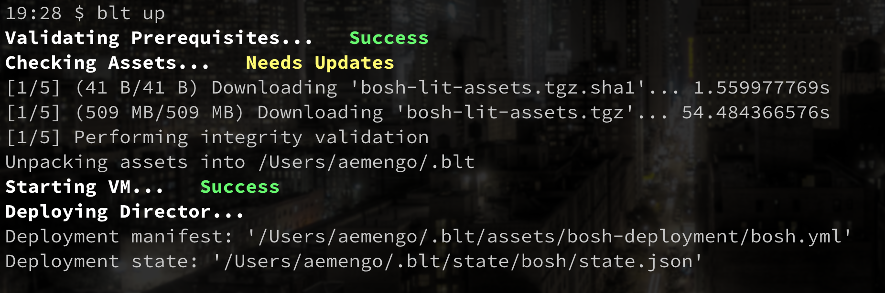
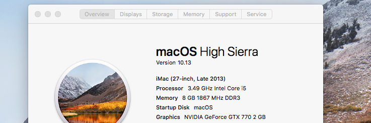
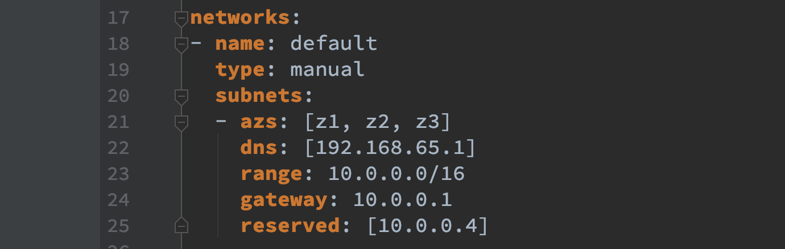
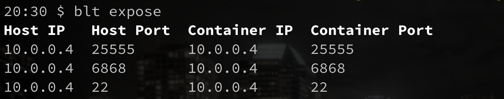
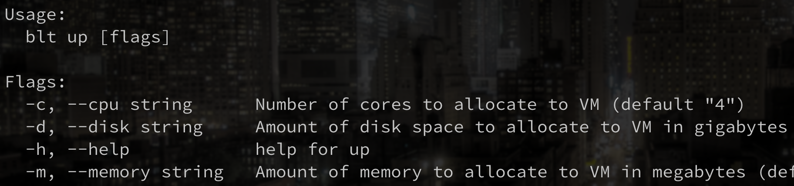
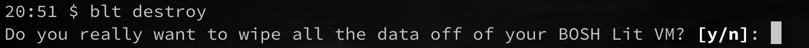

# blt



`blt` stands for **BOSH Lit**. It is a command line utility for standing up a local BOSH environment on your workstation. The provisioning process should *never take longer than 5 minutes*.

It satisfies the same use case as [BOSH Lite](https://bosh.io/docs/bosh-lite/) but is engineered to be faster, be more stable, have a lower footprint, and be easier to use. However, the primary benefit of blt over BOSH Lite is that:

> stemcells and releases get persisted between reboots

`blt` leverages the same latest generation tooling as [docker-desktop](https://www.docker.com/products/docker-desktop), [minikube](https://kubernetes.io/docs/tasks/tools/install-minikube/), and [cfdev](https://github.com/cloudfoundry-incubator/cfdev) to stand up a lightweight VM on a native hypervisor and is powered by the [bosh-runc-cpi](https://github.com/aemengo/bosh-runc-cpi-release). Further information about the BOSH ecosystem can be found here: [https://bosh.io/docs](https://bosh.io/docs/).

## Installation

As of right now, blt is only supported on **macOS High Sierra** and above (10.13+). Running on older versions of macOS is at your own risk.



The preferred method of installation is using the [brew package manager](https://brew.sh):

```bash
# make sure docker-for-mac is installed
# https://www.docker.com/products/docker-desktop

$ brew tap aemengo/tap
$ brew install blt
```

### Prerequisites

* [Docker For Mac](https://www.docker.com/products/docker-desktop)

The following will automatically be installed via `brew`.

* [Linuxkit](https://github.com/linuxkit/linuxkit)
* [BOSH CLI](https://bosh.io/docs/cli-v2/)

## Getting started

To spin up your local BOSH environment:

```bash
$ sudo ifconfig lo0 alias 10.0.0.4 # Allow connections to BOSH Director
$ blt up
...
  Updating instance 'bosh/0'... Finished (00:00:19)
  Waiting for instance 'bosh/0' to be running... Finished (00:00:11)
  Running the post-start scripts 'bosh/0'... Finished (00:00:01)
Finished deploying (00:00:51)

Stopping registry... Finished (00:00:00)
Cleaning up rendered CPI jobs... Finished (00:00:00)

Succeeded
Configuring Director...  Success

Completed in 2m40.516808332s
```
When your environment is fully loaded, you can start deploying right away:

```bash
$ eval "$(blt env)" # Load director credentials into current session
$ bosh -n upload-stemcell "https://s3.amazonaws.com/bosh-core-stemcells/warden/bosh-stemcell-3586.40-warden-boshlite-ubuntu-trusty-go_agent.tgz"
$ bosh -n -d zookeeper deploy <(curl -s https://raw.githubusercontent.com/cppforlife/zookeeper-release/master/manifests/zookeeper.yml)
```

To spin down your environment:

```bash
$ blt down
```

Spinning your environment back up again with `blt up`, will keep your previous working state preserved.

To see the state of your BOSH Lit environment, you can `blt status` at any time:


## Networking

`blt` comes pre-configured with a network of **10.0.0.0/16**, and a director at **10.0.0.4**. It also comes pre-configured with a cloud-config that supports this setup.



However, additional steps must be taken if one wishes to talk to additional IPs from the host machine. In particular ports must be **exposed**. Exposing a port is done with a similar syntax as ssh forwarding.

```bash
# blt expose -L host_address:port:container_address:container_port
$ blt expose -L 10.0.0.5:80:10.0.0.5:80 -L 10.0.0.5:443:10.0.0.5:443
```

To see the list of exposed ports, you can run `blt expose` without any arguments.



**Note:** even after running `blt expose`, you are still responsible for enabling and routing traffic to the specified IP. For example, you can run `sudo ifconfig lo0 alias <IP-Address>`. In addition, the process of exposing a port must be done after subsequent reboots.

## Advanced

### Up

You can customize the **memory**, **cpu**, and **disk** allocated to the BOSH Lit VM. Execute `blt up -h` to see the appropriate flags.



### Prune

Even after running *bosh delete-deployment* or *bosh delete-disk*, you must also run `blt prune` to free up the any unused disk space. Running the command once a week is more than enough.

### Destroy

To wipe out all state regarding BOSH Lit, you can run `blt destroy`. This is an irreversible process.



## License

[Apache 2.0](LICENSE).

Copyright (c) 2018 Anthony Emengo